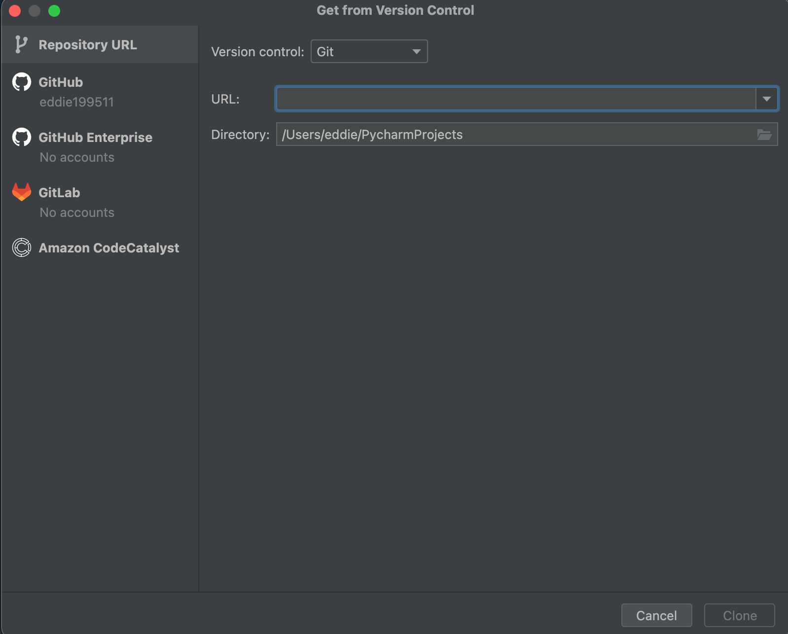

Hey David!

This is a quick tutorial on how to get going with PyCharm and Python.

1. Download the [PyCharm](https://www.jetbrains.com/pycharm/) IDE for your operating system.
2. The free Community Edition should work just fine. The Professional Edition offers a few more bells & whistles.
3. Install the app according to the directions.
4. Launch PyCharm, then Navigate to File -> Project from Version Control
5. You'll see a screen that looks like this: 
